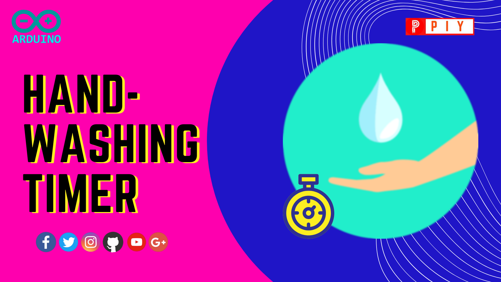
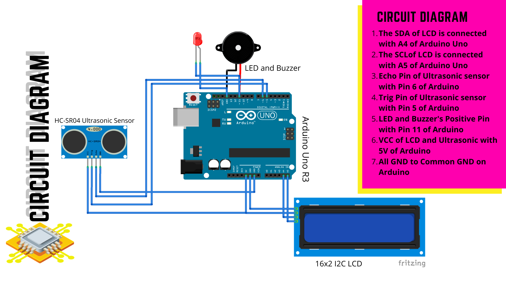

# Hand-Washing Timer....
 

A cool timer gadget to teach you about washing your hands for Twenty Seconds.

At this time of Novel Corona Virus (COVID19), it is essential for all of us to wash our hands properly and it is a must to wash about 20 seconds which will kill the germs in our hands.
So, we've designed a product that is based on Ultrasonic Sensor and it displays the time of 20 seconds in the LCD Screen.

## Components Required
- Arduino Uno R3
- Ultrasonic Sensor
- I2C 16 * 2 LCD Display
- LED and Buzzer

## Circuit Diagram 

## Libraries used
- <a href="https://github.com/arduino-libraries/LiquidCrystal#exactline">Liquid Crystal Library</a> 
- <a href="https://github.com/johnrickman/LiquidCrystal_I2C#exactline">Liquid Crystal I2C Library</a> 

## Code

## Working Video

